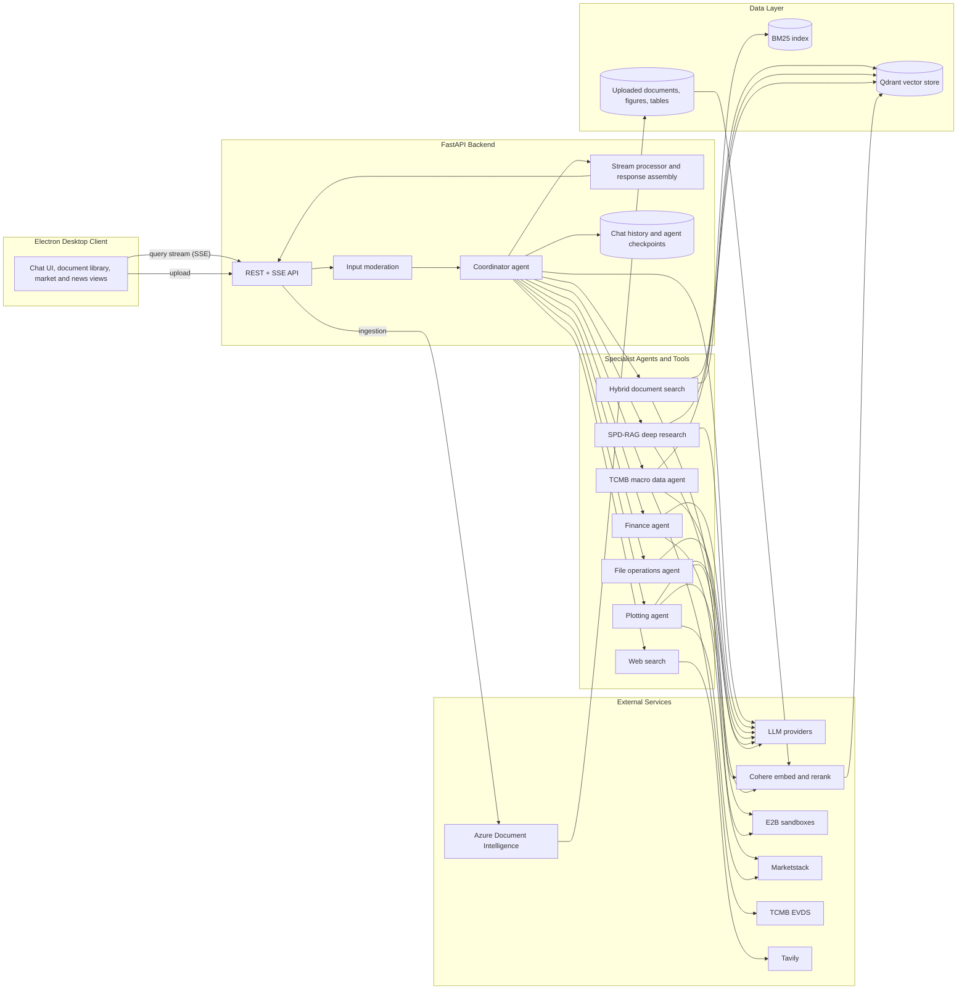
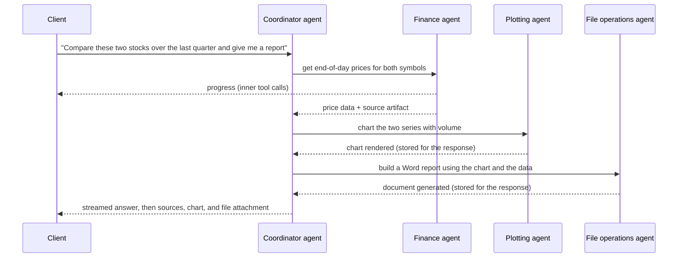
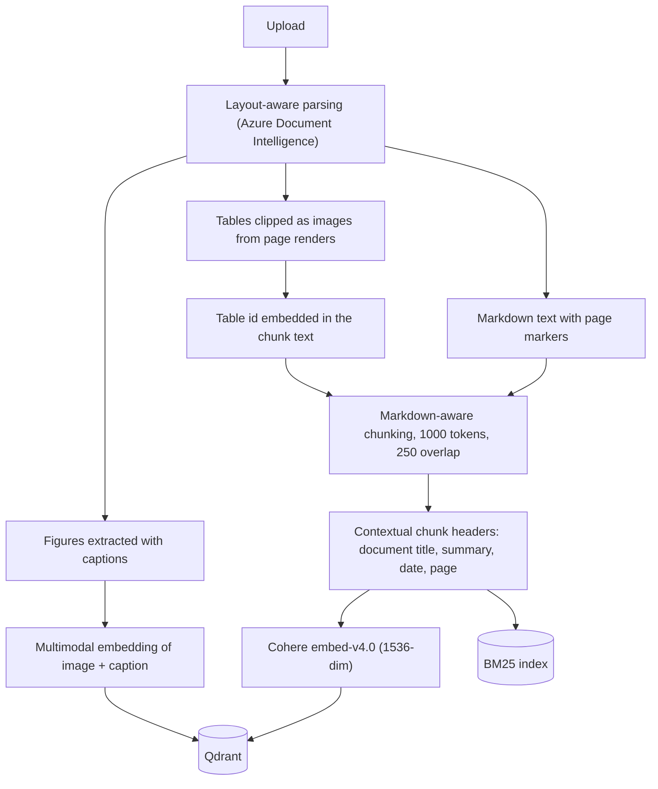
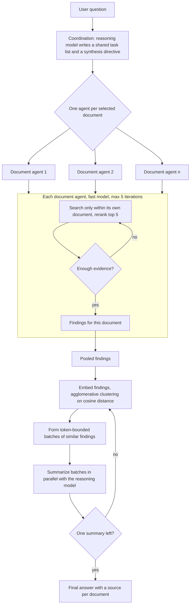

# AIris Architecture

AIris is a multi-agent, B2B financial assistant for financial institutions. It lets staff query large archives of financial documents (policies, credit and leasing contracts, claims files, customer records, internal correspondence, reports) in natural language and get decision-ready, source-grounded answers, charts, and generated Office documents instead of manually searching fragmented archives. The workflows it targets are the ones where delays are costly and evidence must be traceable: coverage checks, claims assessment, policy renewal, contract review, and macro or market reporting. The intended customers are insurers, portfolio managers, financial research houses, and banks.

---

## 1. Overview

AIris is a desktop application with a local backend. The Electron client talks to a FastAPI backend over HTTP and Server-Sent Events. The backend runs a tool-calling coordinator agent that delegates to specialist sub-agents (market data, file operations, plotting, Turkish Central Bank macro data) and to a retrieval layer built on layout-aware document parsing, Cohere embeddings and reranking, an embedded Qdrant vector store, and a BM25 keyword index.

For exhaustive cross-document questions, the coordinator can switch to SPD-RAG (Sub-Agent Per Document RAG): a LangGraph map-reduce graph that assigns one retrieval agent per document, runs them in parallel under a shared instruction set, and merges their findings through similarity-guided, token-bounded recursive synthesis. The approach is published in [arXiv:2603.08329](https://arxiv.org/abs/2603.08329), where it reaches 85.4% of full-context answer quality at 37.9% of the API cost on the Loong benchmark.

All model-generated code (for Word, Excel, and PowerPoint generation and for custom charts) runs in remote E2B sandboxes, never on the host.

Two product principles shape the architecture. First, every answer must be auditable: the system shows which documents, pages, tables, or external sources an answer was derived from, which is the primary defense against hallucination in a domain where verifiability is mandatory. Second, external context is opt-in: web search is a per-query toggle, so an institution can run in an isolated mode over internal data only and enable outside information deliberately. The coordinator's instructions also frame all outputs as analysis rather than investment advice.

The system is built by a five-person founding team with distinct ownership: multi-agent architecture, RAG infrastructure, LLM integration and optimization, full-stack platform and UI, and financial domain modeling. The project placed third in the TEKNOFEST 2025 Financial Technologies competition.

---

## 2. System architecture

### Request flow

1. The user sends a message from the Electron client together with the selected documents and two per-query toggles: web search and SPD-RAG.
2. The API records the message in the session's chat history and runs the input through OpenAI moderation.
3. A coordinator agent is built for the request. Its toolset depends on the toggles: the standard document search tool is swapped for the SPD-RAG deep-research tool when SPD-RAG is on, and the web search tool is only attached when web search is on. The agent is bound to the session's LangGraph checkpoint so multi-turn tool state persists.
4. The agent runs with LangGraph streaming. Tool calls, sub-agent progress, SPD-RAG per-document progress, and answer tokens are converted into a flat stream of SSE events.
5. Every tool that touches an external source returns an artifact alongside its text. These artifacts are collected into a list of sources (documents, URLs, APIs) that is delivered with the final answer.
6. The final event carries the answer text, the sources, any figure or table images retrieved from documents, chart HTML, and metadata for generated Word, Excel, or PowerPoint files. The client renders Markdown and math, shows sources as cards, embeds charts in sandboxed iframes, and lets the user open generated files.

---

## 3. Multi-agent orchestration

The design is hub-and-spoke. One coordinator agent owns the conversation and calls specialists as tools. Each specialist is itself a full tool-calling agent with its own instructions and tools, but from the coordinator's point of view it is a single function that takes a natural-language request and returns text. Specialists never call each other and do not see the conversation; only their final text (plus a source artifact) crosses back into the coordinator's context. This keeps the coordinator's context small and makes each specialist independently testable. It is also what allows the product to be packaged modularly: a deployment can expose a different combination of specialists to different teams without changing the coordinator.

Specialist progress is not hidden: inner tool calls are relayed through LangGraph's custom stream channel, so the UI shows a nested view of what each specialist is doing while the coordinator waits.

| Agent | Role | Tools | Guardrails |
|---|---|---|---|
| Coordinator | Owns the conversation, decomposes the request, calls specialists, writes the final answer | Document search or SPD-RAG deep research, web search (toggle), Wolfram Alpha, file inventory tools, the four specialists below | Recursion limit, conversation summarization when history grows, at most one deep-research pass per turn, prompt caching |
| Finance agent | Market data retrieval | End-of-day prices, dividends, splits, indexes, exchanges, ticker lookup (Marketstack) | Retries with backoff on network errors |
| File operations agent | Read and generate Office documents | Excel, Word, and PowerPoint readers; image description; sandboxed Python execution that produces files | At most two sandbox executions per turn; local syntax check before a sandbox is created |
| Plotting agent | Visualization | Financial chart tool (candlestick, OHLC, line, area, with SMA, EMA, Bollinger, RSI, MACD, volume); custom chart from sandboxed code | One call per chart tool per turn |
| TCMB macro data agent | Turkish Central Bank data | Semantic series discovery over EVDS metadata, then observation retrieval by series code and date range | Hierarchical search (data group first, then series) to keep candidates small |
| SPD-RAG graph | Exhaustive cross-document research | Internal per-document retrieval | Five retrieval iterations per document; token-bounded synthesis |

Auxiliary agents outside the chat path handle balance-of-payments ledger ingestion and financial news clustering and summarization.

---

## 4. Document understanding and retrieval

### Ingestion

Key decisions:

- **Layout-aware parsing, not plain text.** PDFs and Word files go through a layout model that returns Markdown with headings and tables, figure regions, and page spans. Page boundaries are preserved as markers so every chunk knows its page.
- **Tables and figures are first-class.** Tables are kept as Markdown for the model and also clipped as images from a high-resolution page render for the user. Figures are saved, embedded multimodally with their captions, and described on demand by a vision model conditioned on the user's question. Retrieved tables and figures are returned as attachments with the answer.
- **Contextual chunk headers.** Before embedding, each chunk is prefixed with an LLM-generated document title, short summary, date, and page number (the dsRAG AutoContext idea). This makes fragments that are meaningless in isolation (a table row, a continuation paragraph) retrievable and gives the model page information for citations without a second lookup.
- **Hybrid index.** Every chunk is indexed both in Qdrant (cosine similarity) and in a BM25 index for exact-term recall on identifiers, codes, and names.

### Standard retrieval

The default document search tool runs a vector search (top 15, filtered to the documents the user selected) and a BM25 search on model-supplied keywords, merges the candidates, reranks them with Cohere rerank-v4.0-fast to the top 5, attaches vision descriptions for retrieved figures, and returns the chunks with a source artifact per document.

Each answer includes a source list of documents, URLs, and APIs. Page, table, and figure identifiers travel inside the retrieved chunk text and as image attachments, so the model can cite them in the answer.

### SPD-RAG deep research

Three layers, matching the paper:

- **Coordination.** A reasoning model reads the question and produces a shared task list plus a directive for the synthesizer. Every document agent receives the same task list, so findings are comparable across documents.
- **Parallel retrieval.** LangGraph fans out one document agent per selected document. Each agent is a small loop on a cheaper model: search within its own document, judge whether it has enough, repeat up to five times, then write its findings. Because retrieval is confined to one document, a small model is sufficient, and no document can be crowded out of a shared top-k.
- **Synthesis.** Findings are embedded and clustered by similarity. The cluster tree is walked to form the largest batches that stay under a token budget (75% of the synthesis model's context, capped at 750k tokens). Batches are summarized in parallel and the process repeats until one summary remains. This bounds the context of every synthesis call regardless of corpus size and keeps related evidence adjacent.

The UI shows this live: each document appears as it is analyzed, is marked complete when its agent finishes, and a synthesis stage follows.

---

## 5. Tool and function-calling layer

- **Sandboxed code execution.** All generated Python runs in E2B sandboxes with a custom template that includes python-docx, openpyxl, python-pptx, and Pillow. Files the model refers to are staged into the sandbox, outputs are copied back into a managed directory, filenames are sanitized against path traversal, and the sandbox is always destroyed afterwards. This is the path for Word, Excel, and PowerPoint generation and for custom charts.
- **Charts.** Financial charts are rendered with Plotly (interactive HTML plus a PNG export); custom charts come from sandboxed code. Chart images are recorded so the file agent can embed them in generated documents in the same turn.
- **Document export.** There is no separate exporter; generated files are the output of sandboxed code and are returned to the client as attachments and tracked in a created-documents library.
- **External knowledge.** Web search (Tavily) with URL attribution, Wolfram Alpha for computation, Marketstack for market data, and TCMB EVDS for macroeconomic series.
- **Source artifacts.** Every external-facing tool returns a machine-readable artifact next to its text. The stream processor turns these into the source list shown with each answer, which is what makes answers auditable.
- **Input guard.** The current input guard is OpenAI moderation only. Not active in the current codebase.

---

## 6. Component breakdown

| Component | Responsibility | Location | Technologies |
|---|---|---|---|
| Desktop client | Chat, uploads, document and created-file libraries, sources and attachments, live agent progress, market and news dashboards, balance calendar, i18n (en, tr) | `frontend/` | Electron, vanilla JS, marked, KaTeX, highlight.js |
| API layer | Routes, SSE streaming, file management, sessions, market and news endpoints | `backend/app/` | FastAPI, uvicorn, Pydantic |
| Orchestration | Request pipeline, coordinator construction, stream processing, source extraction | `backend/pipeline/`, `backend/core/` | LangChain agents and middleware, LangGraph streaming |
| Specialist agents and tools | Finance, file operations, plotting, TCMB agents; all tools | `backend/core/tools/` | LangChain tools, E2B, Plotly, httpx |
| SPD-RAG | Coordination, per-document parallel retrieval, recursive synthesis | `backend/core/spdrag/` | LangGraph `StateGraph` and `Send`, structured outputs, scikit-learn |
| Ingestion | Parsing, figure and table extraction, chunking, contextual headers, embedding | `backend/utils/`, `backend/pipeline/` | Azure Document Intelligence, PyMuPDF, Cohere |
| Retrieval | Vector and keyword search, reranking, image description | `backend/retrieval/` | Qdrant (async client), custom BM25, Cohere rerank |
| Data services | Market data cache, financial news aggregation and clustering, balance-of-payments ledger, TCMB metadata indexing | `backend/utils/` | SQLite, feedparser, Marketstack, EVDS |
| State | Chat history, agent checkpoints, upload tracking | `backend/core/`, `backend/utils/` | SQLAlchemy, aiosqlite, LangGraph SQLite checkpointer |
| Safety and observability | Input moderation and logging | `backend/security/`, `backend/shared/` | OpenAI Moderation, loguru |
| Evaluation | Trajectory evaluation with an LLM judge | `tests/` | agentevals |

---

## 7. Core capabilities

- Grounded, auditable answers over uploaded PDF, Word, Excel, text, and image files, with sources and the supporting figure and table images attached.
- Multi-modal document understanding: layout, tables, and charts are interpreted, not just plain text.
- Two retrieval modes per query: fast hybrid search, or SPD-RAG exhaustive per-document research for questions that span many documents.
- Macro-data grounding through the Turkish Central Bank's EVDS API, discovered semantically and retrieved by date range.
- Market data and technical indicators from Marketstack, plus a live market dashboard.
- Controllable real-time web search with URL attribution: off by default for an isolated, internal-data-only mode; on when current external context is wanted.
- Automated Word, Excel, and PowerPoint generation through sandboxed code, delivered as attachments.
- Financial and custom charting embedded in responses and reusable in generated documents.
- Persistent sessions with multi-turn tool state; streaming progress for every tool, sub-agent, and SPD-RAG document.
- Financial news feed: Turkish financial RSS sources are aggregated, clustered by story with an LLM, and summarized; the user can open a story and ask questions about it, with a dedicated agent that combines the article context with web search.
- Ancillary workspace features: balance-of-payments ledger ingestion with a calendar view, a live market dashboard, financial calculators.
- Provider flexibility: Anthropic, OpenAI, Qwen, and DeepSeek clients are defined, and a vLLM launcher exists for self-hosted models. Switching is a configuration change; automatic local/cloud routing is not implemented.

### Representative use cases

| Scenario | What happens inside |
|---|---|
| Macro report analysis ("how did the inflation forecast change and which factors were positive?") | Hybrid retrieval over the uploaded report, including chunks linked to the report's tables and charts; figure descriptions from the vision model; the relevant table and chart images returned as attachments alongside the answer. TCMB data can be pulled in to ground the answer in official series. |
| Stock and market reporting over a long horizon | Finance agent gathers end-of-day data; plotting agent renders interactive charts with indicators; file operations agent turns the findings and charts into a Word or PowerPoint deliverable in the same turn. |
| Report and presentation automation (analyst notes to management decks, recurring market notes, investment committee reports) | The coordinator sequences research, structuring, summarization, and document generation across specialists; the user receives the analysis in chat and the finished Office file as an attachment. |
| Multi-document analysis ("across all these contracts, which ones...") | SPD-RAG assigns one agent per document, runs them in parallel under a shared task list, and synthesizes their findings so no document is dropped from a shared top-k. |
| News-driven questions | The news tab surfaces clustered, summarized stories; a question asked inside a story is answered by an agent that has the article as context and can consult the web for related sources. |

---

## 8. Technical differentiators

### Why SPD-RAG

Standard RAG shares one top-k budget across the whole corpus, so for questions like "compare X across all reports" evidence from lower-ranked documents is silently dropped. Agentic RAG issues several global retrievals but each still competes across documents; in the paper it scored no better than standard RAG (32.8 vs 33.0) while using about three times the tokens. Full-context prompting fixes coverage but pays for every token of every document on every query.

SPD-RAG decomposes along the document axis: retrieval is isolated per document, the per-document loops run on a cheaper model in parallel, and only coordination and synthesis use the expensive model. Synthesis is token-bounded and similarity-guided, so context per call stays fixed as the corpus grows and related evidence is summarized together.

Results from the paper on the Loong benchmark (English, 200k-250k token instances, 102 cases, GPT-5 judge):

| System | Avg score | Perfect rate | Cost per query (USD) | Latency (s) |
|---|---|---|---|---|
| Full context (oracle) | 68.0 | 31.4% | 0.273 | 45.6 |
| Normal RAG | 33.0 | 13.7% | 0.080 | 42.6 |
| Agentic RAG | 32.8 | 8.8% | 0.098 | 40.6 |
| SPD-RAG | 58.1 | 18.6% | 0.103 | 54.8 |

SPD-RAG reaches 85.4% of full-context quality at 37.9% of the cost (2.25x cost-quality efficiency), with the largest gains on Clustering (+40.5 over Normal RAG) and Chain of Reasoning (+26.2 over Agentic RAG) tasks. The paper used Gemini 2.5 Pro and Flash; this codebase uses GPT-5 and GPT-5-mini in the same roles.

### Other design choices

- **Specialists as tools.** Keeps the coordinator's context small, makes each specialist independently replaceable, and still exposes inner progress to the user through a custom stream channel.
- **Contextual chunk headers and hybrid indexing.** Improves recall on fragments and identifiers where pure dense retrieval is weak.
- **Table and figure grounding.** Users see the actual table or chart the answer came from, not a text rendering of it.
- **Checkpoint recovery.** An interrupted run can leave a dangling tool call in the persisted session; the runner detects the resulting provider error, clears the session's checkpoint, and retries once instead of leaving the session unusable.
- **Sandbox-first generation.** Nothing the model writes executes on the host, and code is syntax-checked locally before a sandbox is paid for.

---

## 9. Tech stack

| Layer | Technologies |
|---|---|
| Languages | Python 3.11, JavaScript |
| Backend | FastAPI, uvicorn, Pydantic |
| Agents | LangChain 1.x (`create_agent`, middleware), LangGraph 1.x (`StateGraph`, `Send`, streaming), SQLite checkpointer |
| LLMs | Anthropic Claude Sonnet 4.6 (default coordinator and specialists); OpenAI GPT-5 and GPT-5-mini (SPD-RAG), GPT-5.2 (vision), GPT-4o-mini (summarization, news); Qwen and DeepSeek clients defined; OpenAI Moderation |
| Embeddings and reranking | Cohere embed-v4.0 (text and multimodal), Cohere rerank-v4.0-fast |
| Storage | Qdrant (embedded), custom BM25, SQLite (SQLAlchemy, aiosqlite) |
| Document parsing | Azure AI Document Intelligence, PyMuPDF, Pillow, pandas, openpyxl, python-docx, python-pptx |
| Code execution | E2B Code Interpreter |
| Visualization | Plotly, kaleido |
| External data | Marketstack, TCMB EVDS, Tavily, Wolfram Alpha, RSS |
| Frontend | Electron, marked, highlight.js, KaTeX |
| Observability and evaluation | loguru, agentevals |

---

## 10. Reliability, security, and privacy

- **Async throughout.** FastAPI and LangGraph are fully async; Qdrant is accessed through its async client; blocking SDK calls for embeddings and EVDS are offloaded to threads.
- **Bounded execution.** Recursion limits, per-tool call limits, per-document iteration caps, and a token-bounded synthesis loop cap cost and latency for every request.
- **Retries and fallbacks.** Rate-limit retries on embeddings and reranking, backoff on market data requests, one-shot sandbox template rebuild, reranker and header-generation fallbacks, and checkpoint recovery.
- **Session isolation.** Chat history and agent checkpoints are keyed per session. The backend runs as a single-user local process alongside the desktop client.
- **Data path.** Document parsing, embeddings, moderation, and generation call external providers.
- **Network posture.** The API binds to loopback for the local client.
- **Secrets.** Backend credentials come from environment variables.

---

## 11. Evaluation

- A trajectory evaluation harness runs the coordinator on sampled queries and scores each trajectory with an LLM judge (agentevals, o3-mini) together with heuristics for redundant tool calls and loops. The committed run covers three queries, all passing.