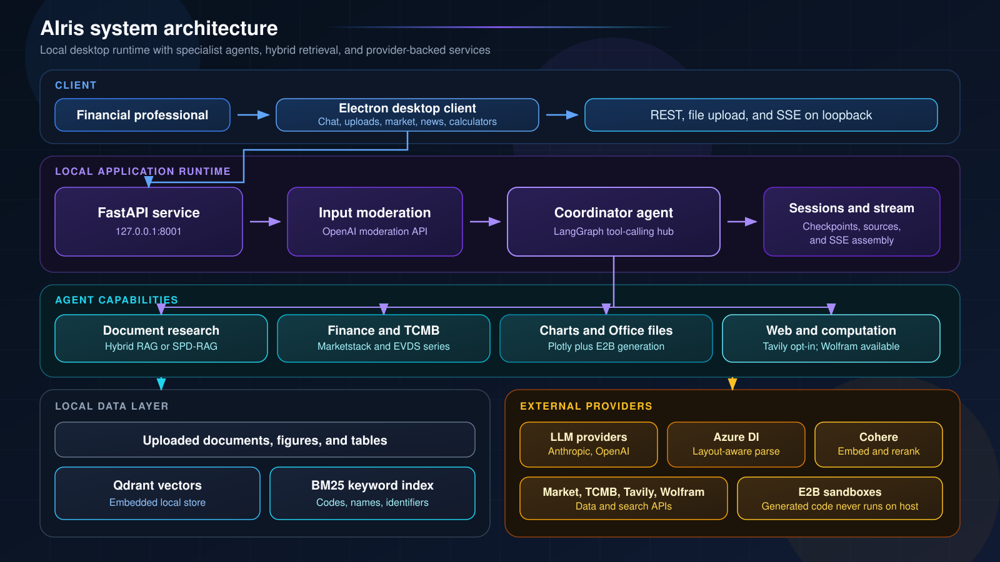
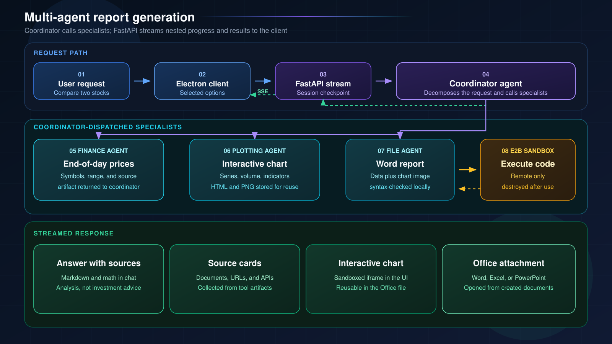
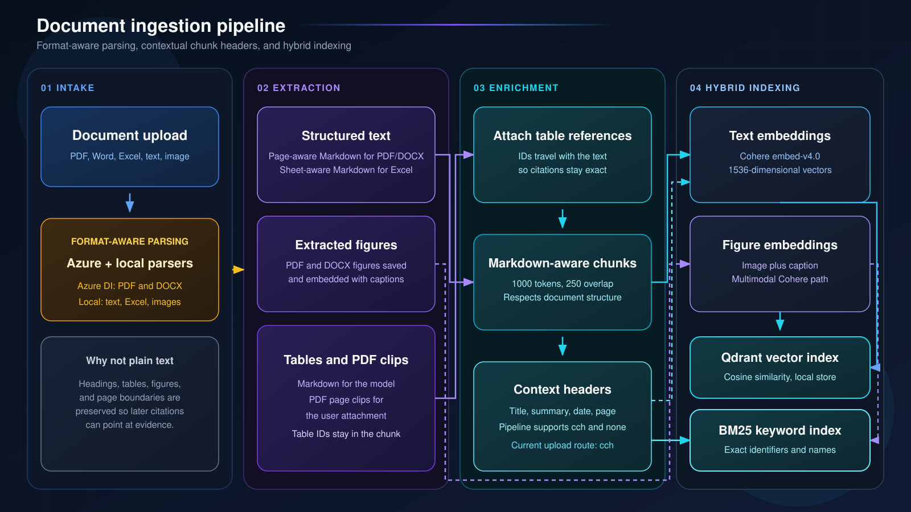
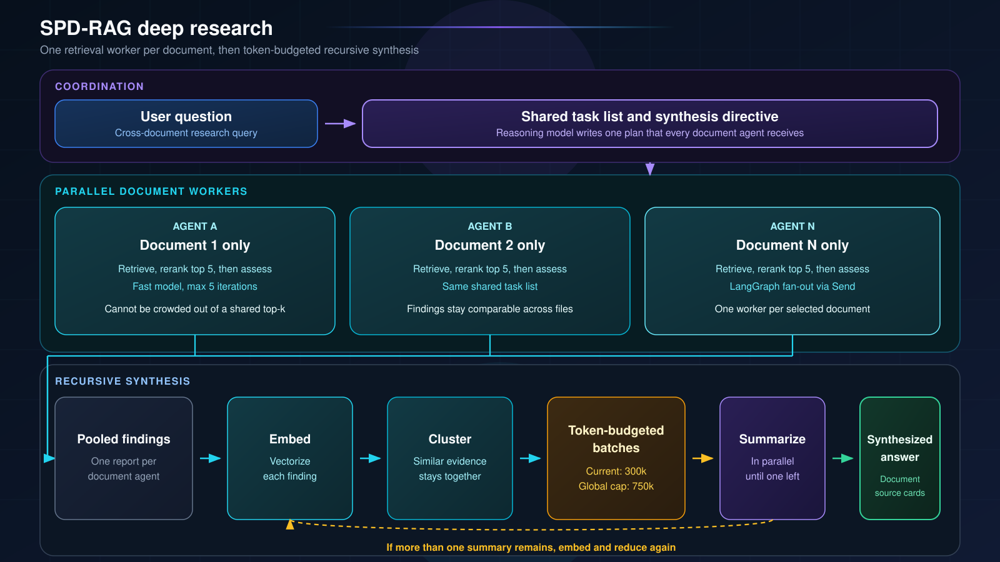

# AIris Architecture

AIris is a multi-agent financial BI platform designed for financial teams. It lets a user query large archives of financial documents (policies, credit and leasing contracts, claims files, customer records, internal correspondence, reports) in natural language and receive analysis with source artifacts, charts, and generated Office documents instead of manually searching fragmented archives. The product design considered workflows such as coverage checks, claims assessment, policy renewal, contract review, and macro or market reporting. The underlying retrieval and generation paths are domain-general; they do not encode insurance, legal, or banking decision rules. The current codebase is a single-user research prototype (see the README's Project status).

This document is the technical reference for component behavior, runtime boundaries, and code navigation. [README.md](README.md) is the reference for product positioning, setup, project status, and headline capabilities.

---

## 1. Overview

AIris is a desktop application with a local backend. The Electron client talks to a FastAPI backend over HTTP and Server-Sent Events. The backend runs a tool-calling coordinator agent that delegates to specialist sub-agents (market data, file operations, plotting, Turkish Central Bank macro data) and to a retrieval layer built on layout-aware document parsing, Cohere embeddings and reranking, an embedded Qdrant vector store, and a BM25 keyword index.

For coverage-oriented cross-document questions, the user can enable SPD-RAG (Sub-Agent Per Document RAG): a LangGraph map-reduce graph that assigns one retrieval worker per selected document, runs them in parallel under a shared instruction set, and merges their findings through similarity-guided, token-budgeted recursive synthesis. The approach is published in [arXiv:2603.08329](https://arxiv.org/abs/2603.08329), where it reaches 85.4% of full-context answer quality at 37.9% of the API cost on the Loong benchmark.

All model-generated code (for Word, Excel, and PowerPoint generation and for custom charts) runs in remote E2B sandboxes, never on the host.

Two product principles shape the architecture. First, answers should be auditable: tools return document, URL, or API artifacts that the client renders as sources. This improves traceability but does not guarantee that every model statement has a citation. Second, main-chat web search is opt-in through a per-query toggle; news-story chat includes web search by design. This controls web context, but it is not an offline mode: model calls, moderation, parsing, embeddings, reranking, and sandbox execution still use external providers. The coordinator's instructions also frame outputs as analysis rather than investment advice.

---

## 2. System architecture

A financial professional uses the Electron desktop client to talk to a local FastAPI service on loopback. The coordinator routes each request to document research, market and TCMB data, chart and Office generation, or optional web search. Persistent document copies and indexes stay on the machine. Selected operations transmit data to external AI, data, and sandbox providers.

### Request flow

1. The user sends a message from the Electron client together with the selected documents and two per-query toggles: web search and SPD-RAG.
2. The API records the message in the session's chat history and runs the input through OpenAI moderation.
3. A coordinator agent is built for the request. Its toolset depends on the toggles: the standard document search tool is swapped for the SPD-RAG deep-research tool when SPD-RAG is on, and the web search tool is only attached when web search is on. The agent is bound to the session's LangGraph checkpoint so multi-turn tool state persists.
4. The agent runs with LangGraph streaming. Tool calls, sub-agent progress, SPD-RAG per-document progress, and answer tokens are converted into a flat stream of SSE events.
5. Document retrieval, web search, Marketstack, TCMB, and Wolfram paths return attribution artifacts alongside their text. These artifacts are collected into a list of sources (documents, URLs, APIs) that is delivered with the final answer. Plotting and file-generation tools are tracked as output artifacts instead, and the source list is not statement-level citation coverage.
6. The final event carries the answer text, the sources, any figure or table images retrieved from documents, chart HTML, and metadata for generated Word, Excel, or PowerPoint files. The client renders Markdown and math, shows sources as cards, embeds charts in sandboxed iframes, and lets the user open generated files.

---

## 3. Multi-agent orchestration

The design is hub-and-spoke. One coordinator agent owns the conversation and calls specialists as tools. Each specialist is itself a full tool-calling agent with its own instructions and tools, but from the coordinator's point of view it is a single function that takes a natural-language request and returns text. Specialists never call each other and do not see the conversation; their final text crosses back into the coordinator's context, with provider attribution artifacts added by the finance and TCMB wrappers. This keeps the coordinator's context small and makes each specialist independently testable. It also keeps the specialist set modular: a different combination of specialists can be attached without changing the coordinator.

Specialist progress is not hidden: inner tool calls are relayed through LangGraph's custom stream channel, so the UI shows a nested view of what each specialist is doing while the coordinator waits.

A comparative stock-report request travels from the desktop through FastAPI to the coordinator. The coordinator obtains end-of-day prices, renders a chart, and asks the file agent to generate a Word document in an E2B sandbox. Nested specialist progress and the final artifacts return to the client over SSE.

| Agent | Role | Tools | Guardrails |
|---|---|---|---|
| Coordinator | Owns the conversation, decomposes the request, calls specialists, writes the final answer | Document search or SPD-RAG deep research, web search (toggle), Wolfram Alpha, file inventory tools, the four specialists below | Recursion limit, conversation summarization when history grows, at most one deep-research pass per turn, prompt caching |
| Finance agent | Market data retrieval | End-of-day prices, dividends, splits, indexes, exchanges, ticker lookup (Marketstack) | Retries with backoff on network errors |
| File operations agent | Read and generate Office documents | Excel, Word, and PowerPoint readers; image description; sandboxed Python execution that produces files | At most two sandbox executions per turn; local syntax check before a sandbox is created |
| Plotting agent | Visualization | Financial chart tool (candlestick, OHLC, line, area, with SMA, EMA, Bollinger, RSI, MACD, volume); custom chart from sandboxed code | One call per chart tool per turn |
| TCMB macro data agent | Turkish Central Bank data | Semantic series discovery over EVDS metadata, then observation retrieval by series code and date range | Hierarchical search (data group first, then series) to keep candidates small |
| SPD-RAG graph | Coverage-oriented cross-document research | Internal per-document retrieval | Five retrieval iterations per document; token-budgeted synthesis |

Auxiliary agents outside the chat path handle balance-of-payments ledger ingestion and financial news clustering and summarization.

---

## 4. Document understanding and retrieval

### Ingestion

PDF and DOCX files are parsed into page-aware Markdown and figures with captions; PDF tables can also be clipped as images. Text, spreadsheets, and standalone images use format-specific local parsers. Structured text and table references are chunked, optionally prefixed with document context, then written to Qdrant and BM25. Figures follow a multimodal embedding path into the vector index.

Key decisions:

- **Layout-aware parsing, not plain text.** PDFs and Word files go through a layout model that returns Markdown with headings and tables, figure regions, and page spans. Page boundaries are retained as markers in the structured text to support attribution.
- **Tables and figures are first-class.** Tables are kept as Markdown for the model; for PDFs, the parser also attempts to clip table images from the rendered page. Figures are saved, embedded multimodally with their captions, and described on demand by a vision model conditioned on the user's question. Retrieved table and figure images can be returned as attachments with the answer.
- **Contextual chunk headers.** The current upload route hardcodes `cch`, so each chunk is prefixed with an LLM-generated document title, short summary, date, and page number (the dsRAG AutoContext idea). This can make fragments that are meaningless in isolation (a table row, a continuation paragraph) easier to retrieve. Although the pipeline also implements `none`, the route does not currently expose or honor a client-selectable preprocessing option.
- **Hybrid index.** Every chunk is indexed both in Qdrant (cosine similarity) and in a BM25 index for exact-term recall on identifiers, codes, and names.

### Standard retrieval

The default document search tool runs a vector search (top 15, filtered to the documents the user selected) and a BM25 search on model-supplied keywords, merges the candidates, reranks them with Cohere rerank-v4.0-fast to the top 5, attaches vision descriptions for retrieved figures, and returns the chunks with a source artifact per document.

Document, URL, and API artifacts from the tools used in a turn are collected into a source list. Page, table, and figure identifiers travel inside retrieved chunk text and as image attachments, so the model can point to specific evidence in its answer.

### SPD-RAG deep research

A reasoning model turns the question into a shared task list. LangGraph assigns one bounded retrieval worker to each selected document. Findings are pooled, clustered by similarity, summarized in token-budgeted batches, and reduced until a synthesized answer remains. The tool returns source artifacts for the selected documents separately from the generated text.

Three layers, matching the paper:

- **Coordination.** A reasoning model reads the question and produces a shared task list plus a directive for the synthesizer. Every document agent receives the same task list, so findings are comparable across documents.
- **Parallel retrieval.** LangGraph fans out one document agent per selected document. Each agent is a small loop on a cheaper model: search within its own document, judge whether it has enough, repeat up to five times, then write its findings. Because retrieval is confined to one document, a small model is sufficient, and no document can be crowded out of a shared top-k.
- **Synthesis.** Findings are embedded and clustered by similarity. The cluster tree is walked to form the largest batches that target a token budget (75% of the synthesis model's context, capped globally at 750k tokens). The current GPT-5-mini configuration has a 400k-token context entry, yielding a 300k-token target. Batches are summarized in parallel and the process repeats until one summary remains. A convergence fallback combines the current level when clustering cannot reduce the batch count, so the target is not a hard per-call guarantee.

The UI shows this live: each document appears as it is analyzed, is marked complete when its agent finishes, and a synthesis stage follows.

---

## 5. Tool and function-calling layer

- **Sandboxed code execution.** All generated Python runs in E2B sandboxes with a custom template that includes python-docx, openpyxl, python-pptx, and Pillow. Files the model refers to are staged into the sandbox, outputs are copied back into a managed directory, filenames are sanitized against path traversal, and the sandbox is always destroyed afterwards. This is the path for Word, Excel, and PowerPoint generation and for custom charts.
- **Charts.** Financial charts are rendered with Plotly (interactive HTML plus a PNG export); custom charts come from sandboxed code. Chart images are recorded so the file agent can embed them in generated documents in the same turn.
- **Document export.** There is no separate exporter; generated files are the output of sandboxed code and are returned to the client as attachments and tracked in a created-documents library.
- **External knowledge.** Web search (Tavily) with URL attribution, Wolfram Alpha for computation, Marketstack for market data, and TCMB EVDS for macroeconomic series.
- **Source artifacts.** Document retrieval, Tavily, Marketstack, TCMB, and Wolfram tools return machine-readable attribution artifacts next to their text. The stream processor turns these into the source list shown with an answer. File and plotting agents produce output artifacts rather than sources, and the list does not prove that every model statement is cited.
- **Input guard.** Both standard and streaming query paths call OpenAI moderation before creating the coordinator. The news-story chat endpoint does not run moderation. The guard currently fails open: moderation errors are logged and the query continues.

---

## 6. Component breakdown

| Component | Responsibility | Location | Technologies |
|---|---|---|---|
| Desktop client | Chat, uploads, document and created-file libraries, sources and attachments, live agent progress, market and news dashboards, balance calendar, i18n (en, tr) | `frontend/` | Electron, vanilla JS, marked, KaTeX, highlight.js |
| API layer | Routes, SSE streaming, file management, sessions, market and news endpoints | `backend/app/` | FastAPI, uvicorn, Pydantic |
| Orchestration | Request pipeline, coordinator construction, stream processing, source extraction | `backend/pipeline/`, `backend/core/` | LangChain agents and middleware, LangGraph streaming |
| Specialist agents and tools | Finance, file operations, plotting, TCMB agents; all tools | `backend/core/tools/` | LangChain tools, E2B, Plotly, httpx |
| SPD-RAG | Coordination, per-document parallel retrieval, recursive synthesis | `backend/core/spdrag/` | LangGraph `StateGraph` and `Send`, structured outputs, scikit-learn |
| Ingestion | Parsing, figure and table extraction, chunking, contextual headers, embedding | `backend/utils/`, `backend/pipeline/` | Azure Document Intelligence, PyMuPDF, Cohere |
| Retrieval | Vector and keyword search, reranking, image description | `backend/retrieval/` | Qdrant (async client), custom BM25, Cohere rerank |
| Data services | Market data cache, financial news aggregation and clustering, balance-of-payments ledger, TCMB metadata indexing | `backend/utils/` | SQLite, feedparser, Marketstack, EVDS |
| State | Chat history, agent checkpoints, upload tracking | `backend/core/`, `backend/utils/` | SQLAlchemy, aiosqlite, LangGraph SQLite checkpointer |
| Safety and observability | Input moderation and logging | `backend/security/`, `backend/shared/` | OpenAI Moderation, loguru |
| Evaluation | Trajectory evaluation with an LLM judge | `tests/` | agentevals |

---

## 7. Runtime scenarios and boundaries

### Representative runtime scenarios

| Scenario | Execution path |
|---|---|
| Macro report analysis | Hybrid retrieval searches the selected report, including chunks linked to tables and extracted figures. Retrieved visuals can be returned with the answer, and the coordinator can call the TCMB specialist for official series. |
| Stock and market reporting | The finance specialist retrieves historical Marketstack end-of-day data, the plotting specialist creates an interactive chart, and the file specialist can generate a Word or PowerPoint deliverable with the chart in an E2B sandbox. This path does not execute trades or provide live market data. |
| Office document automation | The file specialist can read inputs and stage referenced local files in E2B, where syntax-checked model-generated Python produces Word, Excel, or PowerPoint files that return as attachments. |
| Cross-document comparison, such as contracts or policies | When the user enables SPD-RAG, one bounded retrieval worker researches each selected document before the graph synthesizes their findings into one response. Coverage remains retrieval- and model-dependent. |
| News-driven questions | The news workspace provides the selected story as context to a dedicated agent that can use Tavily for related web sources. This endpoint is separate from the moderated main-chat path. |

### Capability boundaries

- Multimodal embeddings apply to figures extracted from PDF and DOCX files. Standalone image uploads are indexed as generic text references.
- The default coordinator and specialist model is Claude Sonnet 4.6. Alternative OpenAI, Qwen, DeepSeek, and local vLLM helpers exist in the repository, but changing the active model requires source and environment changes.
- News, the balance-of-payments ledger/calendar, market dashboards, and deterministic financial calculators are auxiliary workspaces rather than coordinator specialists.

The current implementation maintains these boundaries:

- The Electron client consumes the local HTTP/SSE API. Model-generated Python for files and custom charts runs in E2B rather than in the Electron or FastAPI process.
- The coordinator owns conversation context and calls specialist wrappers. Specialists do not call each other and receive only the task passed by the coordinator.
- Upload parsing and indexing are separate from query-time retrieval. Qdrant and BM25 are populated by the ingestion pipeline and queried through the retrieval layer.
- Source artifacts identify supporting documents, URLs, or APIs. Generated files and charts are output artifacts and are handled separately.
- Application chat history and LangGraph checkpoints are separate forms of state, both keyed by session.

---

## 8. Technical differentiators

### Why SPD-RAG

Standard RAG shares one top-k budget across the whole corpus, so for questions like "compare X across all reports" evidence from lower-ranked documents is silently dropped. Agentic RAG issues several global retrievals but each still competes across documents; in the paper it scored no better than standard RAG (32.8 vs 33.0) while using about three times the tokens. Full-context prompting fixes coverage but pays for every token of every document on every query.

SPD-RAG decomposes along the document axis: retrieval is isolated per document, the per-document loops run on a cheaper model in parallel, and only coordination and synthesis use the expensive model. Synthesis is token-budgeted and similarity-guided so related evidence is summarized together; the convergence fallback described above means the configured batch target is not an absolute bound.

Results from the paper on the Loong benchmark (English, 200k-250k token instances, 102 cases, GPT-5 judge):

| System | Avg score | Perfect rate | Cost per query (USD) | Latency (s) |
|---|---|---|---|---|
| Full context (oracle) | 68.0 | 31.4% | 0.273 | 45.6 |
| Normal RAG | 33.0 | 13.7% | 0.080 | 42.6 |
| Agentic RAG | 32.8 | 8.8% | 0.098 | 40.6 |
| SPD-RAG | 58.1 | 18.6% | 0.103 | 54.8 |

SPD-RAG reaches 85.4% of full-context quality at 37.9% of the cost (2.25x cost-quality efficiency), with the largest gains on Clustering (+40.5 over Normal RAG) and Chain of Reasoning (+26.2 over Agentic RAG) tasks. The paper used Gemini 2.5 Pro and Flash; this codebase uses GPT-5 and GPT-5-mini in the same roles.

In the paper's Loong evaluation all findings fit into a single 750k-token synthesis batch, so the multi-round recursive path is designed for larger corpora than that benchmark exercised.

### Other design choices

- **Specialists as tools.** Keeps the coordinator's context small, makes each specialist independently replaceable, and still exposes inner progress to the user through a custom stream channel.
- **Contextual chunk headers and hybrid indexing.** Context headers are intended to improve retrieval of otherwise ambiguous fragments; BM25 adds exact-term recall for identifiers and names that dense retrieval may miss.
- **Table and figure grounding.** Retrieved tables and charts are returned as images alongside the answer, not only as text renderings.
- **Checkpoint recovery.** An interrupted run can leave a dangling tool call in the persisted session; the runner detects the resulting provider error, clears the session's checkpoint, and retries once instead of leaving the session unusable.
- **Sandbox-first generation.** Nothing the model writes executes on the host, and code is syntax-checked locally before a sandbox is paid for.

---

## 9. Tech stack

| Layer | Technologies |
|---|---|
| Languages | Python 3.11+, JavaScript |
| Backend | FastAPI, uvicorn, Pydantic |
| Agents | LangChain 1.x (`create_agent`, middleware), LangGraph 1.x (`StateGraph`, `Send`, streaming), SQLite checkpointer |
| LLMs | Anthropic Claude Sonnet 4.6 (default coordinator and specialists); OpenAI GPT-5 and GPT-5-mini (SPD-RAG), GPT-5.2 (vision), GPT-4o-mini (summarization, news); Qwen and DeepSeek clients defined; OpenAI Moderation |
| Embeddings and reranking | Cohere embed-v4.0 (text and multimodal), Cohere rerank-v4.0-fast |
| Storage | Qdrant (embedded), custom BM25, SQLite (SQLAlchemy, aiosqlite) |
| Document parsing | Azure AI Document Intelligence, PyMuPDF, Pillow, pandas, openpyxl, python-docx, python-pptx |
| Code execution | E2B Code Interpreter |
| Visualization | Plotly, kaleido |
| External data | Marketstack, TCMB EVDS, Tavily, Wolfram Alpha, RSS |
| Frontend | Electron, marked, highlight.js, KaTeX |
| Observability and evaluation | loguru, agentevals |

---

## 10. Reliability, security, and privacy

- **Async request path.** FastAPI, LangGraph, and Qdrant use async interfaces. Selected blocking SDK calls, including embeddings and EVDS, are offloaded to threads; some parsers and synchronous provider tools remain blocking.
- **Bounded agent loops.** Recursion limits, per-tool call limits, per-document iteration caps, and token-budgeted synthesis constrain agent work, although provider latency and usage still depend on the request and external services.
- **Retries and fallbacks.** Rate-limit retries on embeddings, backoff on market data requests, one-shot sandbox template rebuild, reranker and header-generation fallbacks, and checkpoint recovery.
- **Session isolation.** Chat history and agent checkpoints are keyed per session. The backend runs as a single-user local process alongside the desktop client.
- **Data path.** Azure Document Intelligence receives PDF/Word content; Cohere receives chunks, figures, and retrieval queries; model providers receive prompts and retrieved context; E2B receives generated code and referenced files staged for generation. Market, TCMB, web, computation, RSS, and gold-price features call their respective external services. The renderer loads selected assets from cdnjs, jsDelivr, and Google Fonts.
- **Network posture.** The API binds to loopback for the local client, but has no authentication and currently allows any CORS origin. Loopback does not protect it from untrusted local processes or browser origins.
- **Secrets.** Backend credentials come from environment variables.

---

## 11. Evaluation

- `tests/test_trajectory/test.py` uses a fixed random seed to sample up to five configured queries, runs the coordinator, and scores each trajectory with an LLM judge (agentevals; `openai:o3-mini` by default), together with heuristics for redundant tool calls and loops. It requires live provider credentials and writes a `metrics.txt` report; no result file is committed.