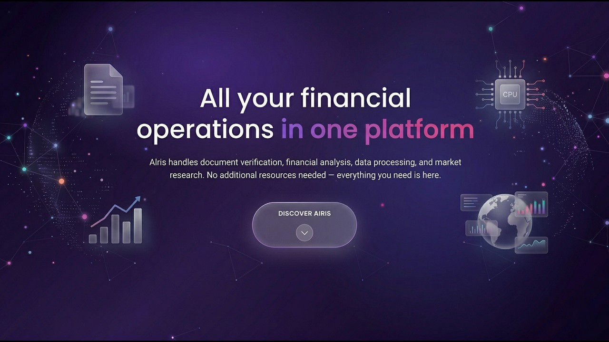

<div align="center">
  
  <h1>AIris</h1>
  <p><strong>A local Windows desktop financial BI platform for source-grounded research, market analysis, and Word, Excel, and PowerPoint generation.</strong></p>
  <p>
    <a href="https://arxiv.org/abs/2603.08329"></a>
    <a href="https://teknofest.org/tr/yarismalar/finansal-teknolojiler-yarismasi/"></a>
    
    <a href="LICENSE"></a>
  </p>
  <p>
    <a href="#demo">Demo</a>
    ·
    <a href="https://arxiv.org/abs/2603.08329">SPD-RAG paper</a>
    ·
    <a href="ARCHITECTURE.md">Architecture</a>
    ·
    <a href="#quick-start">Quick start</a>
    ·
    <a href="CONTRIBUTING.md">Contributing</a>
  </p>
</div>

> [!IMPORTANT]
> AIris is a research prototype that runs locally and calls third-party APIs configured by the user. Some workflows send document content, prompts, or generated artifacts to paid external services. See [External services](#external-services).
>
> The source is available under the [PolyForm Noncommercial License 1.0.0](LICENSE): noncommercial use is permitted, commercial use is not. See [License](#license).

## Demo

<div align="center">
  <a href="https://www.youtube.com/watch?v=bpOPxwwpNus">
    
  </a>
</div>

**Full demo** on YouTube (Turkish audio). The [example workflow](#example-workflow) below is an English written walkthrough of the same capabilities.

## What AIris does

AIris is a financial BI platform for teams whose evidence is scattered across reports, contracts, filings, and market data. A user uploads those documents, asks questions in English or Turkish, and can receive streamed answers with source cards, retrieved table or figure images, charts, and finished Office files.

A coordinator agent owns each conversation and calls specialist agents as tools. Retrieval and provider tools supply evidence from the user's documents and from market, macroeconomic, and web sources. For questions that must cover every selected document, the user can enable SPD-RAG, a per-document retrieval method published in [arXiv:2603.08329](https://arxiv.org/abs/2603.08329) and implemented in this repository.

## Key capabilities

- **Document Q&A with source artifacts.** Hybrid vector and BM25 retrieval with Cohere reranking; responses include source cards and can include supporting table or figure images when retrieved.
- **Document-parallel cross-document research.** SPD-RAG assigns one bounded retrieval worker to each selected document, then merges findings through token-budgeted recursive synthesis.
- **Market and macro data.** Marketstack end-of-day data and Turkish Central Bank EVDS series, discovered semantically and retrieved by date range.
- **Charts and Office deliverables.** Interactive Plotly charts and Word, Excel, or PowerPoint files generated from sandboxed code and returned as attachments.
- **Financial news workspace.** RSS stories clustered and summarized by an LLM, with a dedicated agent for questions about a story.
- **Supporting workspaces.** A market dashboard, deterministic financial calculators, and a calendar-backed transaction ledger.
- **Live progress.** Tool calls, specialist steps, and SPD-RAG document progress are streamed to the desktop client over Server-Sent Events.

## Project status

AIris is a research and competition project intended for local evaluation and extension. It has not been audited for production trading, regulated financial workflows, multi-user deployment, or unattended operation. Generated analysis may omit context or draw unsupported inferences and should be verified against the displayed sources. Source cards expose artifacts returned by tools; they do not guarantee statement-level citation coverage. Outputs are framed as analysis, not investment advice.

## Quick start

### Prerequisites

- Windows with PowerShell
- Python 3.11 or newer
- Node.js 22.12.0 or newer
- [uv](https://docs.astral.sh/uv/getting-started/installation/)
- API keys for the providers listed under [Backend startup configuration](#backend-startup-configuration)

### Install

```powershell
git clone https://github.com/NebulAICompany/AIris.git
Set-Location AIris

uv sync --locked
.\.venv\Scripts\Activate.ps1

Copy-Item .env.example .env
# Edit .env and add your keys.

Set-Location frontend
npm ci
Set-Location ..
```

### Backend startup configuration

The backend creates its provider clients at startup, so these values must be present in `.env` before it will start:

| Variable | Used for |
| --- | --- |
| `ANTHROPIC_API_KEY` | Coordinator and specialist agents |
| `OPENAI_API_KEY` | Moderation, SPD-RAG, summarization, news, vision |
| `COHERE_API_KEY` | Embeddings and reranking |
| `TAVILY_API_KEY` | Web search |
| `QWEN_API_KEY` | Optional alternative coordinator client; unused unless selected in code |
| `AZURE_DOCUMENT_INTELLIGENCE_ENDPOINT` | Document parsing service endpoint |

PDF and DOCX ingestion additionally requires `AZURE_DOCUMENT_INTELLIGENCE_KEY`. The example workflows require the relevant feature keys listed under [External services](#external-services). `.env` is ignored by git; never commit it.

### Run

Start the backend, then start the desktop client in a second terminal:

```powershell
.\.venv\Scripts\Activate.ps1
python backend_runner.py
```

```powershell
.\.venv\Scripts\Activate.ps1
python frontend_runner.py
```

Success state: `GET http://127.0.0.1:8001/health` returns JSON and the Electron window opens. The first start takes longer while local stores initialize.

To package a Windows x64 NSIS installer after `npm ci`:

```powershell
Set-Location frontend
$env:CSC_IDENTITY_AUTO_DISCOVERY = "false"
npm run build
Set-Location ..
```

The installer is written to `frontend/dist/`. The packaged desktop client still expects a separately running local backend.

## Example workflow

1. Upload a central bank inflation report (PDF). Azure Document Intelligence extracts page-aware Markdown, tables, and figures; chunks are embedded with Cohere and indexed in Qdrant and BM25.
2. Ask: "How did the inflation forecast change, and which factors were positive?" The coordinator runs hybrid retrieval over the selected report and returns an answer with source cards plus the relevant table and chart images. It can call the TCMB agent to ground the answer in official series.
3. Ask: "Compare these two stocks over the last quarter and give me a report." The coordinator calls the finance agent for end-of-day prices, the plotting agent for an interactive chart, and the file agent, which generates a Word document in an E2B sandbox. The chart and the document are returned as attachments.
4. Select several contracts and enable SPD-RAG. Ask: "Across all of these contracts, which ones...". One worker researches each document in parallel; the findings are clustered and synthesized into one answer returned with document source cards while the client shows per-document progress.

## Architecture

The Electron client talks to a local FastAPI process on `127.0.0.1:8001` over HTTP and Server-Sent Events. A LangGraph coordinator owns the conversation and calls specialists as tools; specialists do not call each other. Persistent document copies and indexes are stored on the machine. Parsing, embedding, model inference, and generated-code execution use external providers, and all model-generated code runs in remote E2B sandboxes rather than on the host.

Select any diagram to open its full-size SVG.

[](docs/assets/architecture/system-overview.svg)

### Multi-agent orchestration

The report-generation path below shows the coordinator sequencing finance, plotting, and file-generation specialists. Nested tool progress and final artifacts return to the client through the same SSE stream.

[](docs/assets/architecture/multi-agent-sequence.svg)

### Document ingestion and retrieval

Uploaded files pass through format-aware parsing, contextual chunk headers, and hybrid indexing. Text and structured content are searchable through Qdrant and BM25, while extracted figures follow a multimodal embedding path.

[](docs/assets/architecture/document-ingestion.svg)

Read the [technical architecture deep dive](ARCHITECTURE.md) for component responsibilities, request flow, agent guardrails, retrieval internals, reliability mechanisms, and design rationale.

## SPD-RAG research

Standard RAG shares one top-k budget across the whole corpus, so evidence from lower-ranked documents is dropped on questions like "compare X across all reports". SPD-RAG (Sub-Agent Per Document RAG) decomposes retrieval along the document axis: a reasoning model writes a shared task list, one bounded worker researches each document in parallel, and findings are clustered and summarized in token-budgeted batches until one answer remains.

[](docs/assets/architecture/spd-rag.svg)

- **Paper:** [arXiv:2603.08329](https://arxiv.org/abs/2603.08329)
- **Implementation in this repository:** [`backend/core/spdrag/`](backend/core/spdrag/)
- **Benchmark code and data:** [NebulAICompany/SPD-RAG](https://github.com/NebulAICompany/SPD-RAG)
- **Citation:** [`CITATION.cff`](CITATION.cff)

Results reported in the paper on the Loong benchmark (English, 200k-250k token instances, 102 cases, GPT-5 as judge; higher score is better):

| System | Average score | Cost per query (USD) |
| --- | ---: | ---: |
| Full-context baseline | 68.0 | 0.273 |
| Normal RAG | 33.0 | 0.080 |
| Agentic RAG | 32.8 | 0.098 |
| SPD-RAG | 58.1 | 0.103 |

In that evaluation SPD-RAG reached 85.4% of full-context quality at 37.9% of its API cost. The paper used Gemini 2.5 Pro and Flash; this repository uses GPT-5 and GPT-5-mini in the same roles. The table reproduces the paper's numbers and is not a benchmark run from this repository.

## Evaluation

Agent behavior is evaluated with trajectory scoring: [`tests/test_trajectory/test.py`](tests/test_trajectory/test.py) runs the coordinator on sampled queries, scores each full trajectory with an LLM judge ([agentevals](https://github.com/langchain-ai/agentevals)), and applies heuristics for redundant or looping tool calls. It calls live providers and writes a `metrics.txt` report.

```powershell
.\.venv\Scripts\Activate.ps1
python tests/test_trajectory/test.py
```

Benchmark results for SPD-RAG come from the paper and its [evaluation repository](https://github.com/NebulAICompany/SPD-RAG).

## External services

AIris uses bring-your-own credentials. Each provider may charge for requests.

| Provider | Feature | Data sent | Key |
| --- | --- | --- | --- |
| Anthropic | Coordinator and specialist agents | Prompts and retrieved context | `ANTHROPIC_API_KEY` (startup) |
| OpenAI | Moderation, SPD-RAG, summarization, news, vision | Prompts, retrieved context, figure images | `OPENAI_API_KEY` (startup) |
| Cohere | Embeddings and reranking | Document chunks, figures, and queries | `COHERE_API_KEY` (startup) |
| Tavily | Web search | Search queries | `TAVILY_API_KEY` (startup) |
| Qwen | Alternative coordinator and specialist model | Prompts and retrieved context | `QWEN_API_KEY` (optional unless selected in code) |
| Azure Document Intelligence | PDF and Word parsing | Uploaded document content | `AZURE_DOCUMENT_INTELLIGENCE_ENDPOINT` (startup), `AZURE_DOCUMENT_INTELLIGENCE_KEY` |
| E2B | Sandboxed chart and Office generation | Generated code and referenced files | `E2B_API_KEY` |
| Marketstack | Market data and dashboard | Symbol and date requests | `MARKETSTACK_API_KEY` |
| TCMB EVDS | Turkish Central Bank series | Series codes and date ranges | `TCMB_API_KEY` |
| Wolfram Alpha | Computation | Query text | `WOLFRAM_APP_ID` |
| GoldAPI or MetalpriceAPI | Live gold prices in the desktop widget | Price requests | `GOLDAPI_KEY` or `METALPRICEAPI_KEY` |
| cdnjs, jsDelivr, Google Fonts | Renderer styles, fonts, and client-side libraries | Standard network request metadata | None |

Optional: `QWEN_API_KEY`, `DEEPSEEK_API_KEY`, and LangSmith tracing variables. Full variable list: [`.env.example`](.env.example).

## Privacy and data flow

- The Electron client and FastAPI backend run on the local machine. Persistent chat history, uploads, and indexes are stored under `backend/database/`, which is ignored by git; the embedded Qdrant and BM25 data live under `backend/database/vectorstore/`.
- Document content leaves the machine when it is parsed (Azure), embedded or reranked (Cohere), included in a prompt (model providers), or staged for generation (E2B), as listed above.
- Main-chat web search is off unless the user enables it for a query; news-story chat includes web search.
- The renderer loads selected styles, fonts, and libraries from public CDNs when the application starts.
- The API binds to loopback. CORS is limited to the desktop origins and is not a boundary for other local processes. Run it on a trusted machine and do not expose port `8001`.

## Supported files

| Kind | Extensions |
| --- | --- |
| Documents | `.pdf`, `.docx`, `.txt` |
| Spreadsheets | `.xlsx`, `.xls` |
| Images | `.png`, `.jpg`, `.jpeg`, `.gif`, `.bmp` |

## Limitations

- Single-user desktop application; no multi-tenant or hosted deployment.
- Model outputs are non-deterministic and depend on the configured providers; provider outages affect the corresponding features.
- The default coordinator model is Claude Sonnet 4.6. OpenAI, Qwen, and DeepSeek clients are available as alternatives; switching is a code change.
- Benchmark results above come from the paper, not from a committed evaluation run in this repository.
- Local frontend tests exist (`frontend` `npm test`). Broader automated unit coverage is not yet part of the project; evaluation still relies on trajectory scoring and manual verification of workflows.

## Documentation

| Document | Content |
| --- | --- |
| [ARCHITECTURE.md](ARCHITECTURE.md) | Components, request flow, ingestion, SPD-RAG internals, design decisions |
| [CONTRIBUTING.md](CONTRIBUTING.md) | Environment setup, pull-request expectations, verifying changes |
| [CODE_OF_CONDUCT.md](CODE_OF_CONDUCT.md) | Contributor Covenant 2.1, with project enforcement contact |
| [SECURITY.md](SECURITY.md) | Vulnerability reporting and scope |
| [CITATION.cff](CITATION.cff) | Machine-readable citation metadata |
| [LICENSE](LICENSE) | PolyForm Noncommercial License 1.0.0 |
| [NOTICE](NOTICE) | Required copyright notice |
| [`.env.example`](.env.example) | Environment variable reference |

## Implementation map

| Area | Start here |
| --- | --- |
| Desktop client | [`frontend/src/main.js`](frontend/src/main.js), [`frontend/src/renderer/scripts/app.js`](frontend/src/renderer/scripts/app.js) |
| FastAPI routes and SSE | [`backend/app/main.py`](backend/app/main.py), [`backend/app/router.py`](backend/app/router.py) |
| Coordinator and stream processing | [`backend/core/agents.py`](backend/core/agents.py), [`backend/core/runner.py`](backend/core/runner.py), [`backend/pipeline/query.py`](backend/pipeline/query.py) |
| Specialist agents and tools | [`backend/core/tools/agent_as_tools.py`](backend/core/tools/agent_as_tools.py), [`backend/core/tools/`](backend/core/tools/) |
| Ingestion and retrieval | [`backend/pipeline/upload.py`](backend/pipeline/upload.py), [`backend/retrieval/`](backend/retrieval/) |
| SPD-RAG | [`backend/core/spdrag/graph.py`](backend/core/spdrag/graph.py), [`backend/core/spdrag/nodes.py`](backend/core/spdrag/nodes.py) |
| Sandboxed generation and state | [`backend/core/tools/file_tools.py`](backend/core/tools/file_tools.py), [`backend/core/checkpointer.py`](backend/core/checkpointer.py) |
| Trajectory evaluation | [`tests/test_trajectory/test.py`](tests/test_trajectory/test.py), [`tests/test_trajectory/judge.py`](tests/test_trajectory/judge.py) |

## Recognition

AIris was developed by a five-person founding team spanning AI engineering, full-stack development, finance, and business development. Competing as team NebulAI, it placed third in the [TEKNOFEST 2025 Financial Technologies competition](https://teknofest.org/tr/yarismalar/finansal-teknolojiler-yarismasi/).

## Contributing

Contributions are welcome. See [CONTRIBUTING.md](CONTRIBUTING.md) for setup, pull-request expectations, and how to verify changes that depend on external providers. Contributions are accepted under the project [license](#license).

## Security

The backend binds to loopback. CORS is limited to the desktop origins. The Electron main process opens only credential-free HTTP(S) links and keeps gold API keys out of the renderer. Do not open public issues for vulnerabilities. Follow the process in [SECURITY.md](SECURITY.md).

## Citation

If you use SPD-RAG or this implementation in academic work, cite the paper:

```bibtex
@misc{akay2026spdrag,
  title         = {SPD-RAG: Sub-Agent Per Document Retrieval-Augmented Generation},
  author        = {Yagiz Can Akay and Muhammed Yusuf Kartal and Esra Alparslan and Faruk Ortakoyluoglu and Arda Akpinar},
  year          = {2026},
  eprint        = {2603.08329},
  archivePrefix = {arXiv},
  primaryClass  = {cs.CL},
  doi           = {10.48550/arXiv.2603.08329},
  url           = {https://arxiv.org/abs/2603.08329}
}
```

GitHub also exposes [CITATION.cff](CITATION.cff) via **Cite this repository**.

## License

AIris is licensed under the [PolyForm Noncommercial License 1.0.0](LICENSE). You may use, modify, and share the software for noncommercial purposes, including personal study, research, and use by educational and other noncommercial organizations, under the terms in `LICENSE`. Commercial use requires a separate agreement — contact [nebulaicompany@gmail.com](mailto:nebulaicompany@gmail.com).

Required Notice: Copyright 2025-2026 Nebula Intelligence team

This is a source-available license, not an OSI-approved open-source license, so GitHub may not detect it automatically. The license does not require attribution in publications, but if you build on SPD-RAG or this implementation in academic work, we ask that you cite the paper as shown in [Citation](#citation).
